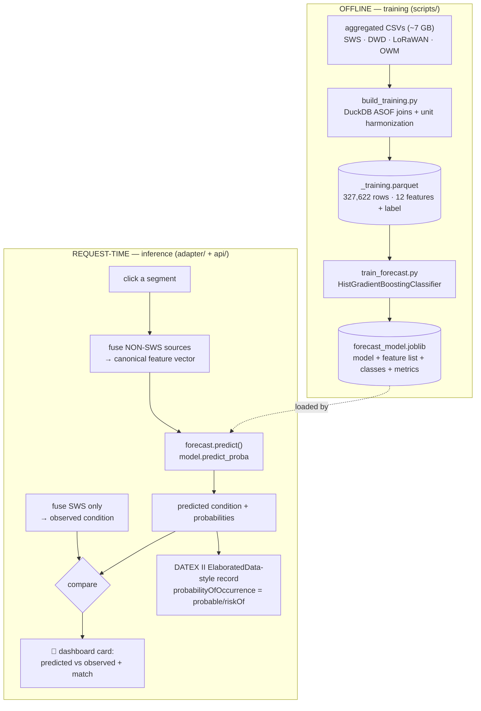
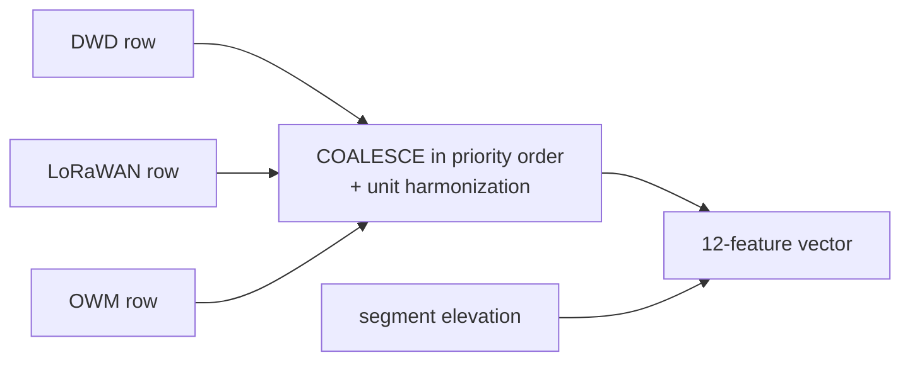
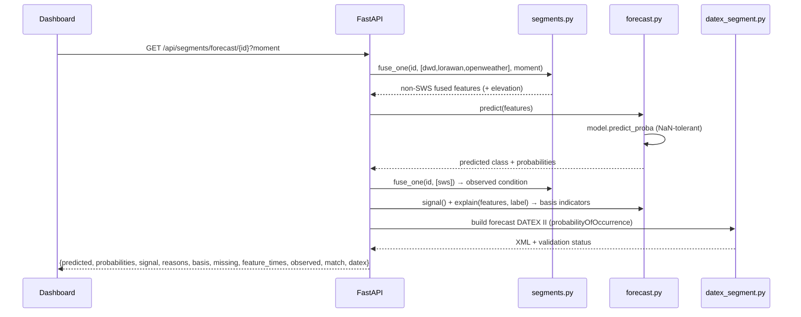

# Forecast / Road-Condition Prediction — Methodology

How the road-condition prediction model is **trained** and how it **predicts** at
request time. Companion to `docs/IMPLEMENTATION_OVERVIEW.md`.

> **Scope (read this first).** This model performs **nowcasting / spatial inference**:
> it predicts the *current* road-surface condition of a segment from the *current*
> surrounding atmospheric & IoT data — i.e. *"fill in the road condition where there is
> no in-road sensor."* It is **not** a time-ahead forecast ("what will the road be in
> 6 h"). The path to a true time-ahead forecast is summarised in §10.

---

## 1. The idea

Road-surface condition (dry / wet / ice / snow) is physically governed by temperature,
dew point, humidity, precipitation, wind and terrain. Only **SWS** (in-road sensors)
measure the condition directly, and they are **sparse**. So the question is:

> *Can we reconstruct the SWS road-condition reading from the surrounding
> DWD / LoRaWAN / OpenWeather data alone — on segments that have no road sensor?*

The model answers exactly that.

| | |
|--|--|
| **Target (label)** | SWS `road_condition_code`: `0 dry · 1 moist · 2 wet · 3 ice · 4 snow` |
| **Inputs (features)** | **only non-SWS sources** (DWD, LoRaWAN, OpenWeather) + segment elevation |
| **Task** | 5-class classification, per road segment |
| **Why exclude SWS from features** | the use case is predicting *where SWS is absent*; using it would be reading the answer off the sensor |

---

## 2. End-to-end pipeline



---

## 3. Feature engineering — built the *same way* as inference

This is the most important design choice. Training features are constructed by the
**identical non-SWS priority coalesce + unit harmonization that the fusion engine uses
at request time**, so the model never sees a feature distribution at training that
differs from serving (no train/serve skew).

For each canonical feature, the value is the first available among the non-SWS sources
in fusion priority, after unit conversion:

| Canonical feature | Coalesce (priority, non-SWS) | Unit fix |
|-------------------|------------------------------|----------|
| `air_temp_c` | LoRaWAN → DWD → OWM | OWM Kelvin → °C (−273.15) |
| `humidity_pct` | LoRaWAN → DWD → OWM | — |
| `dew_point_c` | LoRaWAN → DWD | — |
| `road_surface_temp_c` | LoRaWAN | — (null when no LoRaWAN) |
| `subsurface_temp_5cm_c` | DWD soil 5 cm | — |
| `precipitation_mm_h` | DWD → OWM | OWM mm/3h → mm/h (÷3) |
| `wind_speed_ms` | DWD → OWM | — |
| `wind_direction_deg` | DWD → OWM | — |
| `pressure_hpa` | DWD → OWM | — |
| `visibility_m` | DWD → OWM | — |
| `cloud_cover_pct` | DWD → OWM | DWD oktas 0–8 → % (×12.5) |
| `elevation_m` | segment metadata (`segments.db`) | — |



---

## 4. Why ASOF joins (timestamp alignment)

The sources don't sample on the same clock, so an **exact** `(segment_id, timestamp)`
join loses most rows:

| join | yield (200 k SWS sample) |
|------|--------------------------|
| SWS × DWD (exact) | 24.3 % |
| SWS × LoRaWAN (exact) | 21.6 % |
| SWS × OpenWeather (exact) | 78.1 % |

So `build_training.py` uses DuckDB **ASOF joins** — for each SWS label, take each
feature source's **most recent reading at-or-before** that label's time, per segment
(the same "latest at-or-before" logic used for the map moments). This keeps essentially
all label rows while staying causal (never uses a future reading).

---

## 5. Sampling & class imbalance

The raw labels are extremely skewed (months of mostly-dry roads):

| code | condition | raw rows |
|------|-----------|----------|
| 0 | dry | 13,353,614 |
| 1 | moist | 3,402,992 |
| 2 | wet | 425,153 |
| 3 | ice | 83,300 |
| 4 | snow | 7,622 |

Training on that as-is would make the model ignore ice/snow. So we **stratified-sample**:
cap **80,000 rows per class** (all 7,622 of snow) → **327,622 training rows** with a
near-balanced mix, and additionally pass `class_weight="balanced"` to the model.

---

## 6. The model

`scikit-learn` **HistGradientBoostingClassifier** — gradient-boosted decision trees.

**Why this model:**
- **Handles missing features natively** — `road_surface_temp_c` is null ~60 % of the time
  (only LoRaWAN supplies it, covering 666 of 1,021 segments). No imputation needed.
- State-of-the-art for **tabular** data; captures non-linear interactions (e.g. *surface
  temp < 0 °C **and** high humidity → ice*) that a linear model can't.
- Fast to train, no feature scaling required.

**Hyperparameters** (`train_forecast.py`):
```
max_iter=400, learning_rate=0.08, max_depth=8,
l2_regularization=1.0, class_weight="balanced", random_state=42
```

The saved `forecast_model.joblib` bundles the fitted model **plus** the feature list,
class order, and the held-out metrics, so inference is self-describing.

---

## 7. Evaluation

**Split:** 80 / 20 stratified train/test (`random_state=42`). **Feature completeness in
the training set:** all features 0 % null except `road_surface_temp_c` (59.6 %) and
`subsurface_temp_5cm_c` (0.4 %).

**Held-out results: accuracy 0.86 · macro-F1 0.86**

| class | precision | recall | F1 | support |
|-------|-----------|--------|----|---------|
| dry | 0.89 | 0.87 | 0.88 | 16,000 |
| moist | 0.81 | 0.70 | 0.75 | 16,000 |
| wet | 0.81 | 0.88 | 0.84 | 16,000 |
| **ice** | **0.95** | **0.98** | **0.97** | 16,000 |
| snow | 0.77 | 0.98 | 0.86 | 1,525 |

**Reading the numbers:**
- **Ice is the headline** — F1 0.97. Ice has a strong, separable physical signature
  (sub-zero surface temp + moisture), exactly what matters for the use case.
- **Moist (F1 0.75) is the weakest** — "moist/damp" is a borderline state that overlaps
  physically with dry and wet, so the model confuses adjacent classes there.
- High recall on ice/snow means it **rarely misses** a dangerous condition.

---

## 8. Inference at request time



Concretely:
1. `GET /api/segments/forecast/{id}` fuses the **non-SWS** sources for that segment into
   the 12-feature vector (adding `elevation_m`).
2. `adapter/forecast.predict()` loads the cached model, builds a one-row DataFrame in the
   saved feature order (missing → `NaN`), and calls `predict_proba` → top class + the
   full probability distribution.
3. The endpoint **separately** fuses SWS only to get the observed (ground-truth)
   condition, and computes a `match` flag.
4. It then builds the **"on what basis" indicators** (§9): `signal()` grades how decisive
   the call is (top probability + margin over the runner-up), `explain()` produces
   plain-English reasons that quote the actual input values, and `basis`/`missing` list
   the salient inputs used (with their source) or absent.
5. The prediction is published as **validated DATEX II** with
   `probabilityOfOccurrence` = `probable` (p ≥ 0.66) or `riskOf` (lower) — never
   `certain` (that's reserved for observed data).

---

## 9. How the prediction is shown

When you click a segment, a **🔮 "Predicted condition (no road sensor)"** card renders
in the side panel:

- the **predicted condition** pill + confidence %,
- a **signal-strength badge** — `strong` / `moderate` / `tentative` call, from the top
  probability and its margin over the runner-up (tells a stakeholder *how much to trust
  this specific call*),
- a **verdict vs ground truth**: `✓ matches SWS`, `✗ differs from SWS (…)`, or
  `no SWS ground truth here` (the real use case — a segment with no road sensor),
- the **top-3 class probabilities** as bars (how confident, and the runner-up),
- **"Why:"** — plain-English reasons that quote the actual input values (e.g. *surface
  −0.5 °C at/below freezing · humidity 96 % moisture available to freeze*), mirroring the
  published Decision-Tree logic,
- **"Based on:"** — the salient inputs used, each tagged with the **source** that supplied
  it, plus a **⚠ missing-input** note when a key signal has no reading (so it never looks
  like invented data),
- **🕐 reading timestamps** for each input source (and the SWS truth), making source
  disagreement legible,
- the **DATEX II validity** + `probabilityOfOccurrence`, plus model metadata
  (held-out accuracy and which sources fed the prediction).

> **Honesty note.** The **"Why:"** reasons are an *interpretive* explanation layer —
> rule-of-thumb indicators consistent with the model's output and the published DT
> thresholds, **not** the literal gradient-boosting tree path. A fully model-faithful
> attribution (e.g. SHAP values) is a future step; the framing to give a reviewer is
> *"an explanation aligned with the model's decision, using the same features it consumes."*

Example response (`/api/segments/forecast/16117045?moment=ice-event-night`):
```json
{
  "predicted": {"label":"Snow","probability":0.763,
                "probabilities":{"Dry":0.0,"Damp":0.0,"Wet":0.005,"Ice":0.232,"Snow":0.763},
                "accuracy":0.86},
  "signal":    {"level":"strong","top":0.763,"margin":0.531},
  "reasons":   ["air -2.8°C — cold enough for snow"],
  "basis":     [{"label":"Road surface temp","value":-3.29,"unit":"°C","source":"lorawan"},
                {"label":"Air temp","value":-2.75,"unit":"°C","source":"lorawan"},
                {"label":"Humidity","value":92.5,"unit":"%","source":"lorawan"}],
  "missing":   [],
  "feature_times": {"lorawan":"2025-11-24 03:00:00+01:00","dwd":"2025-11-24 03:00:00+01:00"},
  "observed":  {"label":"Snow","has_truth":true,"time":"2025-11-24 03:00:00+01:00"},
  "match":     true,
  "feature_sources":["dwd","lorawan"],
  "datex":     {"status":"valid","probability_of_occurrence":"probable"}
}
```
Story: *"from DWD + LoRaWAN alone — no in-road sensor — the model makes a **strong Snow
call** because the air is −2.8 °C, and that matches what the SWS station actually
measured."*

---

## 10. Honest limitations & the path to a true forecast

**Current limitations**
- **Nowcast, not time-ahead.** Label time = feature time; it infers the *present*
  condition spatially, it does not forecast the future.
- **Random (not temporal) split**, so 0.86 is mildly optimistic — adjacent timestamps can
  appear in both train and test. A time-based split gives a stricter number.
- **Region-specific** (Hof) and trained on the available aligned data — a prototype model.
- ASOF can use a slightly stale feature reading in sparse gaps.

**To turn it into the professor's time-ahead forecast**
| Add | Why |
|-----|-----|
| future-horizon label (condition at t + 1/3/6 h) | makes it a forecast, not a nowcast |
| **weather *forecast* inputs** (DWD/OWM forecast feeds) | you can't predict the future from current obs alone |
| temporal train/test split (earlier→later months) | the only honest way to measure forecast skill |
| DATEX II `ElaboratedDataPublication` wrapper | the standard's construct for forecast/derived data + validity window |
| (optional) the professor's LightGBM `road_condition_*.txt` + feature spec | only if reusing their existing models |

The pipeline, fusion, feature construction, validation and DATEX plumbing already in
place are **directly reusable** for that upgrade — the two essential additions are a
**future horizon on the label** and **forecast weather as inputs**.

---

## 11. Reproduce

```bash
# needs the aggregated CSVs in /mnt/e/Ice Prediction
python scripts/build_training.py     # → data/_training.parquet (ASOF-joined features+labels)
python scripts/train_forecast.py     # → data/forecast_model.joblib  (prints the metrics above)

# at runtime the model is served automatically:
#   GET /api/segments/forecast/{segment_id}?moment=ice-event-night
```

Relevant files: `scripts/build_training.py`, `scripts/train_forecast.py`,
`adapter/forecast.py`, `api/segments_routes.py` (`/forecast/{id}`),
`outputs/datex_segment.py` (forecast DATEX), `data/forecast_model.joblib`.
