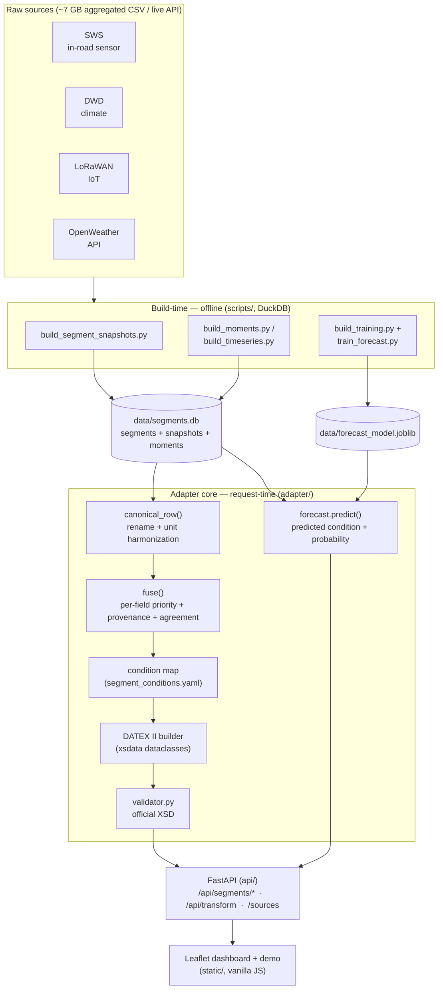
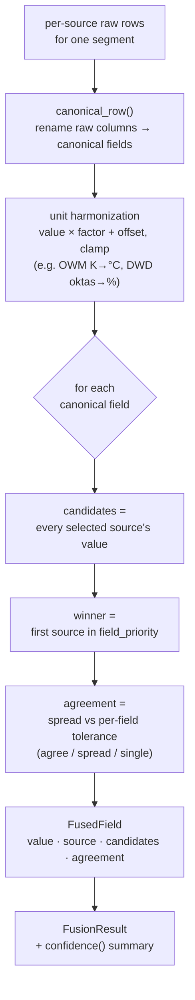
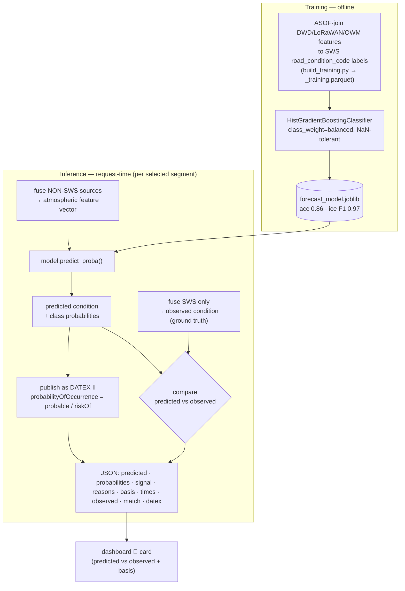
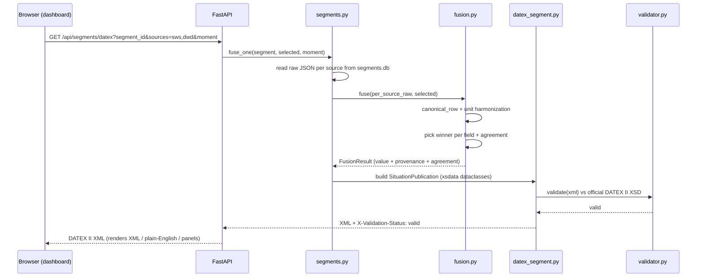

# DATEX II Road-Weather Adapter — Implementation Overview

A walk-through of *what* the system does, *how* it is built, and *why* each piece
exists. Written to be read top-to-bottom when explaining the project.

---

## 1. The problem

The Hof region (Bavaria) has **four independent road-weather data sources** that do
not talk to each other and use different formats, fields, and units:

| Source | What it is | Carries |
|--------|-----------|---------|
| **SWS** | Straßenwetterstationen (in-road sensors) | road-surface **condition** (ground truth), surface/air temp, water film |
| **DWD** | National climate stations | air temp, humidity, pressure, cloud, precipitation, soil temp, visibility |
| **LoRaWAN** | 137 IoT road sensors | surface temp, air temp/humidity, dew point |
| **OpenWeather** | City-level weather API | temp, humidity, clouds, rain, wind |

The goal: **fuse** these into one coherent per-road-segment view and **publish it in
DATEX II v3** — the European standard (CEN/TS 16157) any national traffic centre can
consume — with the output **validated against the official XSD**. A secondary goal is
to **predict** road condition where no in-road sensor exists (ice prediction).

The research contribution is the **per-field, config-driven fusion with provenance**
and the **standards-conformant output**, not the map UI.

---

## 2. Architecture at a glance



**Key design decision:** the heavy data crunching happens **offline** (build scripts →
SQLite). **Fusion runs at request time** on the stored raw JSON, so toggling sources,
changing the moment, or editing `fusion.yaml` changes the output instantly with **no
database rebuild**.

---

## 3. Data layer

### Build scripts (`scripts/`, run once, offline)
- **`build_segment_snapshots.py`** — streams the ~7 GB aggregated CSVs with **DuckDB**,
  reprojects road geometry (EPSG:25832 → WGS84) with `shapely`/`pyproj`, and writes
  `data/segments.db`: 1,021 road segments + the **latest reading per (segment, source)**
  as raw JSON (`segment_snapshot`, 3,619 rows).
- **`build_moments.py`** — freezes named historical timestamps (the 24 Nov 2025 ice
  event, hard-freeze, wet-autumn) into `segment_moment`, using "latest at-or-before the
  moment within a lookback" so the map shows authentic conditions.
- **`build_timeseries.py`** — 31 **hourly** snapshots across the ice event (`ts:*`
  moments) for the time slider; each big CSV is scanned **once** into an in-memory
  window, then sliced per hour. (Slider currently hidden in the UI.)
- **`build_training.py`** — assembles the forecast training set via DuckDB **ASOF joins**
  (nearest prior reading per segment), → `data/_training.parquet`.
- **`train_forecast.py`** — trains the model → `data/forecast_model.joblib`.
- **`generate_dataclasses.py`** — runs **xsdata** over the DATEX II XSDs → 914 Python
  dataclasses in `generated/datex2/`.

### Stored artefacts (`data/`)
- **`segments.db`** (committed) — `segments`, `segment_snapshot`, `segment_moment`,
  `moment_meta`. This is what the live app reads.
- **`sensors.json`** (committed) — the **real physical sensor network** (177 stations
  with coordinates + each station's latest reading and its `ts` timestamp) extracted from
  the raw full-export CSVs by `scripts/build_sensors.py`: SWS 13 · LoRaWAN 137 · DWD 1 ·
  OpenWeather 26. Drives the dashboard sensor layer (markers show `🕐 as of …`).
- **`stations.json`** — a legacy hand-picked subset of 8 LoRaWAN stations (kept for the
  older `/api/segments/stations` endpoint; the dashboard now uses `sensors.json`).
- **`forecast_model.joblib`** (committed) — the trained classifier.
- **`demo.db`** (git-ignored, ~951 MB) — raw LoRaWAN + OWM observation history.

---

## 4. The fusion engine — `adapter/fusion.py` (+ `profiles/fusion.yaml`)

This is the heart of the project. `fusion.yaml` declares, **per canonical field**, which
sources can supply it and in what priority order — *no code changes to onboard a new
source or region*:

```yaml
field_priority:
  surface_condition:   [sws]                          # only SWS measures it
  road_surface_temp_c: [sws, lorawan]
  air_temp_c:          [sws, lorawan, dwd, openweather]
  pressure_hpa:        [dwd, openweather]
```

`FusionProfile.fuse(segment_id, per_source_raw, selected)` does, per field:
1. collect **every selected source's value** (the *candidates*),
2. pick the **winner** = first candidate in priority order,
3. record **provenance** (which source won) and **cross-source agreement**.

It returns a `FusionResult` of `FusedField(value, source, candidates, agreement, spread)`.



> Important nuance to explain: priority is **authored domain knowledge**, not computed
> from data volume or recency. SWS leads the road fields because it is the trusted
> in-road sensor *and the only source that carries road condition at all* — which is why
> deselecting SWS turns every segment "Unknown".

### Unit harmonization (declared, not hard-coded)
`fusion.yaml` also has a `unit_conversions` block: per source/raw-column linear
`value*factor + offset` with optional `clamp`. Applied inside `canonical_row()` so all
sources reach the fusion step in **one canonical unit system**:
- SWS precipitation mm/s → mm/h (×3600); DWD cloud oktas 0–8 → % (×12.5, clamp 0–100);
  OWM rain mm/3h → mm/h (÷3); **OWM air temp Kelvin → °C (−273.15)**.

### Agreement / confidence
When ≥2 sources report a field, they "agree" if their spread is within a per-field
tolerance (`agreement_tolerance` in `fusion.yaml`); otherwise it is flagged a
disagreement. `FusionResult.confidence()` summarises overall trust (high/medium/low).
*(This is what surfaced the Kelvin bug above — the OWM value disagreed with everyone.)*

---

## 5. Condition mapping — `profiles/segment_conditions.yaml`

The fused `surface_condition` code (0–4) is mapped to a **verified DATEX II enum literal**
(`dry`, `moist`, `wet`, `ice`, `snowOnTheRoad`) plus English/German labels and a map
colour. A second profile (`bavaria.yaml`) proves the mapping layer is swappable.

---

## 6. DATEX II standardization — `outputs/datex_segment.py`

Builds a **real `SituationPublication`** from the generated xsdata dataclasses (not string
templates): each segment → a `Situation` → a `WeatherRelatedRoadConditions` record with
the condition enum, a `PointLocation`, fused `RoadSurfaceConditionMeasurements` (surface
temp, water film), and a `probabilityOfOccurrence`. It is serialized and re-rooted under
`<payload xsi:type="sit:SituationPublication">` (the schema's single global element).

**`adapter/validator.py`** validates the XML against the **official DATEX II v3 XSD**
using `xmlschema` (schema compiled once and cached). Every `/datex` response carries an
`X-Validation-Status: valid` header — this is the conformance proof.

---

## 7. Forecast path — `adapter/forecast.py` (+ training scripts)

Predicts road condition **from atmospheric sources only (no road sensor)** — the
ice-prediction use case.

- **Training** (`build_training.py` + `train_forecast.py`): features are built by the
  *same non-SWS priority coalesce* the fusion engine uses at inference (so train/serve
  match), label = SWS `road_condition_code`. Model = **HistGradientBoostingClassifier**
  (`scikit-learn`, NaN-tolerant). **Held-out accuracy 0.86, ice F1 0.97.**
- **Inference**: `GET /api/segments/forecast/{id}` fuses the non-SWS sources → feature
  vector → predicted condition + class probabilities, compares to the observed SWS
  condition, and **publishes the prediction as validated DATEX II** with
  `probabilityOfOccurrence = probable/riskOf` (vs `certain` for observed data).



### How the prediction is shown (the demo flow)

The forecast is **not a separate screen** — it appears inline when you click a segment:

1. `selectSegment()` in the dashboard calls `renderForecast(id)`, which hits
   `GET /api/segments/forecast/{id}?moment=…`.
2. The endpoint returns a JSON object like:
   ```json
   {
     "predicted":  {"label":"Ice","probability":0.987,
                    "probabilities":{"Dry":0.0,"Damp":0.005,"Wet":0.001,"Ice":0.987,"Snow":0.006},
                    "accuracy":0.86},
     "signal":     {"level":"strong","top":0.987,"margin":0.982},
     "reasons":    ["surface -0.5°C — at/below freezing","humidity 96% — moisture available to freeze"],
     "basis":      [{"label":"Road surface temp","value":-0.5,"unit":"°C","source":"lorawan"}],
     "missing":    [],
     "feature_times": {"lorawan":"2025-11-24 03:00:00+01:00","dwd":"2025-11-24 03:00:00+01:00"},
     "observed":   {"label":"Ice","has_truth":true,"time":"2025-11-24 03:00:00+01:00"},
     "match":      true,
     "feature_sources":["dwd","lorawan"],
     "datex":      {"status":"valid","probability_of_occurrence":"probable"}
   }
   ```
3. The dashboard renders a **🔮 "Predicted condition (no road sensor)"** card in the
   selected-segment panel showing:
   - the **predicted condition** pill + confidence %, and a **signal-strength badge**
     (`strong` / `moderate` / `tentative` — from the probability margin, so a stakeholder
     sees *how much to trust this call*),
   - a **verdict** vs ground truth — `✓ matches SWS`, `✗ differs from SWS (…)`, or
     `no SWS ground truth here` (the honest case: a segment with no road sensor),
   - the **top-3 class probabilities** as little bars (so you see *how confident* and
     what the runner-up was),
   - **"Why:"** — plain-English reasons quoting the actual input values, and **"Based on:"**
     — the salient inputs used with their **source** (plus a ⚠ note for any missing signal),
   - **🕐 reading timestamps** per input source, and the **DATEX II validity** +
     `probabilityOfOccurrence`, plus model metadata (accuracy + feature sources).

So the story the panel tells is: *"using only the surrounding atmospheric/IoT data — no
in-road sensor — the model predicts Ice at 99% (a **strong call**, because the surface is
below freezing with high humidity), and that matches what the SWS station actually
measured."* On segments with no SWS, there is no ground-truth row, which is exactly where
such a prediction would be used in practice. The **"Why:"** reasons are an interpretive
layer (consistent with the model + published DT thresholds), not the literal tree path.

---

## 8. API — `api/` and source plug-ins (`sources/`)

FastAPI (`api/main.py` + `api/segments_routes.py`). Selected endpoints:

| Endpoint | Purpose |
|----------|---------|
| `GET /health`, `GET /sources` | liveness + auto-discovered source health |
| `GET /api/segments/geojson` | all fused segments + condition/colour/values/provenance/agreement |
| `GET /api/segments/coverage` | counts + condition distribution |
| `GET /api/segments/fused/{id}` | one fused segment (for the compare view) |
| `GET /api/segments/datex` | XSD-validated DATEX II for one segment |
| `GET /api/segments/datex/city` | validated multi-segment publication |
| `GET /api/segments/forecast/{id}` | predicted vs observed + forecast DATEX |
| `GET /api/segments/sensors` | real physical sensor network, all sources (177 stations) |
| `GET /api/segments/stations` | legacy 8-station LoRaWAN subset |
| `GET /api/segments/moments` / `/timeline` | named moments / hourly steps |
| `POST /api/transform` | **generic** raw multi-source JSON → validated DATEX II |

**Source plug-ins** (`sources/`): a `Source` ABC + a `SegmentSqliteSource` base with one
subclass per source, plus a live `wdms` stub. `registry.py` **auto-discovers** them — a
timing middleware stamps `X-Transform-Time-Ms` on every response.

---

## 9. Frontend — `static/dashboard.html`

Single file, **vanilla JS + Leaflet** (no build step). It calls the API and renders:
the road network (coloured by fused condition), source toggles + All/Reset, the
ground-sensor layer with nearest-station line, the **selected-segment panel** (fused
values + provenance + agreement dots + confidence + 🔮 predicted-vs-observed), the
**DATEX II output** (XML / plain-English toggle + download), and a **compare** modal.
Map interaction is polished: hit-tolerance, hover highlight, click-to-zoom, clickable
condition filters. `static/demo.html` is a simpler 3-panel view for non-technical viewers.

---

## 10. Request lifecycle (end-to-end trace)



Clicking a segment with sources `sws,dwd` selected:

1. Browser → `GET /api/segments/datex?segment_id=…&sources=sws,dwd&moment=latest`.
2. `segments.py::fuse_one` reads that segment's raw JSON per source from `segments.db`.
3. `fusion.py::canonical_row` renames columns + harmonizes units → canonical dict.
4. `fusion.py::fuse` picks the winner per field by priority, records provenance + agreement.
5. `segment_conditions.yaml` maps the condition code → DATEX II enum literal.
6. `datex_segment.py` builds a `SituationPublication` from xsdata dataclasses → XML.
7. `validator.py` validates it against the official XSD → `X-Validation-Status: valid`.
8. Response → dashboard renders XML + plain-English + the confidence/forecast panels.

Everything from step 2 happens **per request** — fusion is live.

---

## 11. Tech stack

- **Python / FastAPI / Pydantic v2** — API and models
- **xsdata** — 914 generated DATEX II v3 dataclasses; **xmlschema** + **lxml** — XSD validation
- **DuckDB** — out-of-core CSV processing in the build scripts; **SQLite** — runtime store
- **shapely / pyproj** — geometry + reprojection
- **scikit-learn / pandas / joblib** — the forecast model
- **Leaflet** (CDN) — the map; no frontend build pipeline
- **pytest** — 49 tests (XSD conformance matrix, fusion, agreement, endpoints, forecast)

---

## 12. How to run / reproduce

```bash
# run the app (reads the committed segments.db + model — works on a fresh clone)
python -m uvicorn api.main:app --port 8000
# → http://localhost:8000/dashboard   /demo   /docs

pytest -q                       # 49 tests
python scripts/evaluate.py      # latency + XSD conformance + provenance numbers

# rebuild the data/model from the raw CSVs (needs /mnt/e/Ice Prediction)
python scripts/generate_dataclasses.py
python scripts/build_segment_snapshots.py --rebuild
python scripts/build_moments.py
python scripts/build_training.py && python scripts/train_forecast.py
```

---

## 13. Honest limitations (good to state up front)

- Only **SWS** carries ground-truth road condition. Real station coordinates exist for
  all sources in the raw full exports (SWS 13, LoRaWAN 137, DWD 1, OWM 26 — see
  `sensors.json`); the aggregated/segment-keyed pipeline drops them, so fusion is
  segment-based. No live ingestion (offline snapshots).
- Field mappings in `fusion.yaml` and the build scripts are tied to the Hof CSV schema;
  a new region needs its own ingestion step (the adapter core is reusable as-is).
- The forecast model is trained on the available aligned data — a prototype predictor,
  not a production-validated model.
