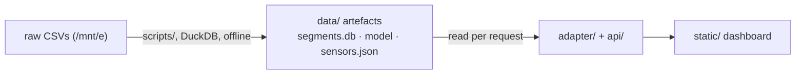

# Project Structure

A map of the repository: what each directory and file is for, and how they fit
together. Companion to `docs/IMPLEMENTATION_OVERVIEW.md` (the architecture & flow).

---

## 1. Annotated tree

```
datex2-adapter/
│
├── api/                     # FastAPI web layer (HTTP only — no business logic)
│   ├── main.py              #   app, middleware (timing header), /health, /sources, /dashboard, /demo
│   ├── segments_routes.py   #   all /api/segments/* + /api/transform endpoints
│   └── routers/             #   (empty — reserved/legacy)
│
├── adapter/                 # THE CORE. Pure Python, no HTTP. The fusion + standardization brain.
│   ├── fusion.py            #   FusionProfile/FusedField/FusionResult — per-field priority, units, agreement
│   ├── segments.py          #   read segments.db; fuse_segments(), fuse_one(); moments/timeline; stations
│   ├── forecast.py          #   load model + predict() + explain()/signal() (prediction + basis)
│   ├── validator.py         #   XSD validation gate (xmlschema vs official DATEX II v3)
│   ├── models.py            #   canonical Pydantic models (CanonicalObservation, etc.)
│   ├── scenarios.py         #   predefined demo scenarios for /demo
│   ├── segment_map.py       #   legacy folium map renderer (fallback; dashboard uses /geojson)
│   └── profiles/__init__.py #   load_profile() — loads the condition-mapping YAMLs
│
├── profiles/                # CONFIG = the research artefact. Behaviour without code.
│   ├── fusion.yaml          #   per-field source priority + unit_conversions + agreement_tolerance
│   ├── segment_conditions.yaml  # condition code → DATEX II enum + labels + colour (5-class)
│   └── bavaria.yaml         #   second mapping profile (proves the layer is swappable)
│
├── outputs/                 # Serialization to the standard
│   └── datex_segment.py     #   build SituationPublication from xsdata classes → validated DATEX II XML
│
├── sources/                 # Pluggable input adapters (auto-discovered)
│   ├── base.py              #   Source ABC
│   ├── segment_sqlite.py    #   SegmentSqliteSource base + sws/dwd/lorawan/openweather plug-ins
│   ├── wdms_api.py          #   live WDMS Flask source (stub; optional)
│   └── registry.py          #   auto-discovery + health_report() → GET /sources
│
├── generated/datex2/        # 913 xsdata dataclasses generated from the DATEX II XSDs (do not hand-edit)
│
├── schemas/DATEXII_3_Profile/   # the official DATEX II v3 XSD bundle (committed → self-contained)
│
├── scripts/                 # OFFLINE build & tooling (run by hand, not at request time)
│   ├── generate_dataclasses.py   # XSDs → generated/datex2/ (xsdata)
│   ├── build_demo_db.py          # raw LoRaWAN/OWM history → data/demo.db
│   ├── build_segment_snapshots.py# aggregated CSVs → data/segments.db (segments + latest snapshots)
│   ├── build_moments.py          # named historical moments (ice event, hard-freeze, wet-autumn)
│   ├── build_timeseries.py       # 31 hourly steps for the time slider (ts:* moments)
│   ├── build_training.py         # ASOF-joined feature/label set → data/_training.parquet
│   ├── train_forecast.py         # train HGB model → data/forecast_model.joblib
│   ├── build_sensors.py          # full-export CSVs → data/sensors.json (per-moment sensor readings, ASOF-aligned)
│   └── evaluate.py               # latency / XSD-conformance / provenance metrics
│
├── static/                  # Frontend (vanilla JS + Leaflet, no build step)
│   ├── dashboard.html       #   the main fusion + map dashboard
│   └── demo.html            #   simple 3-panel non-technical demo
│
├── data/                    # Runtime data + build artefacts
│   ├── segments.db          #   COMMITTED — what the live app reads (segments, snapshots, moments)
│   ├── forecast_model.joblib#   COMMITTED — trained ice-prediction model
│   ├── sensors.json         #   COMMITTED — real sensor network, per-moment readings (177 stations × 35 moments)
│   ├── stations.json        #   COMMITTED — legacy 8-station LoRaWAN subset (old /stations)
│   ├── demo.db              #   git-ignored (~951 MB) raw observation history
│   ├── _training.parquet    #   git-ignored build artefact (data/_* ignored)
│   └── _sample_datex.xml, _ice_map.png   # git-ignored samples
│
├── tests/                   # pytest suite (49 tests)
│   ├── test_segments.py     #   fusion, agreement, endpoints, stations, timeline, forecast
│   ├── test_datex.py        #   DATEX II XSD conformance matrix + semantic round-trip
│   └── test_smoke.py        #   app/health smoke tests
│
├── docs/                    # Documentation
│   ├── IMPLEMENTATION_OVERVIEW.md  # architecture + flow diagrams (read first)
│   ├── PROJECT_STRUCTURE.md        # this file
│   ├── ARCHITECTURE.md, PROTOTYPE.md, PROGRESS.md, PANEL_QA.md,
│   └── SOFTWARE_SPECIFICATION_AND_DESIGN.md
│
├── pyproject.toml           # deps + packaging
├── Dockerfile               # clean-clone build (regenerates dataclasses)
├── docker-compose.yml
└── README.md                # quickstart + endpoint table
```

---

## 2. The layers, from input to output

The codebase is deliberately layered so each directory has one job:

| Layer | Directory | Responsibility | Knows about… |
|-------|-----------|----------------|--------------|
| **Config** | `profiles/` | *what* to do (priorities, units, mappings) | nothing (pure YAML) |
| **Core** | `adapter/` | fuse, harmonize, map, validate, predict | `profiles/`, `data/`, `generated/` |
| **Serialization** | `outputs/` | build standard DATEX II XML | `adapter/`, `generated/` |
| **Inputs** | `sources/` | expose each data source uniformly | `adapter/models`, `data/` |
| **Web** | `api/` | HTTP routing only | `adapter/`, `outputs/`, `sources/` |
| **UI** | `static/` | render + interact | the API (over HTTP) |
| **Build** | `scripts/` | produce `data/` artefacts offline | the raw CSVs, `adapter/` |

Rule of thumb: **`api/` is thin** (parse query → call `adapter` → return). All the
real logic lives in `adapter/`, and all the *behaviour* is driven by `profiles/`.

---

## 3. Build-time vs request-time (important distinction)

- **`scripts/` run offline, by hand**, and write to `data/`. They touch the big raw
  CSVs (~7 GB) and use DuckDB. You run them only when the source data or model changes.
- **`adapter/` + `api/` run per request** and only read the small committed artefacts
  (`segments.db`, `forecast_model.joblib`, `sensors.json`). Fusion happens live, so a
  `fusion.yaml` edit changes output immediately — no rebuild.



---

## 4. "Where do I change X?" quick reference

| I want to… | Edit |
|------------|------|
| Add a new data source / change which source wins a field | `profiles/fusion.yaml` (+ a `sources/` plug-in for live data) |
| Add/adjust a unit conversion | `profiles/fusion.yaml` → `unit_conversions` |
| Tune when sources "agree" | `profiles/fusion.yaml` → `agreement_tolerance` |
| Change a condition → DATEX II enum / colour / label | `profiles/segment_conditions.yaml` |
| Change the fusion algorithm itself | `adapter/fusion.py` |
| Change the DATEX II document shape | `outputs/datex_segment.py` |
| Add / change an API endpoint | `api/segments_routes.py` |
| Change the dashboard look/behaviour | `static/dashboard.html` |
| Retrain / change the forecast model | `scripts/build_training.py` + `scripts/train_forecast.py`, served by `adapter/forecast.py` |
| Change the prediction "why"/signal-strength indicators | `adapter/forecast.py` → `explain()` / `signal()`; rendered in `static/dashboard.html` (`renderForecast`) |
| Change the physical sensor markers on the map | rebuild `data/sensors.json` via `scripts/build_sensors.py`; styled in `static/dashboard.html` |
| Rebuild the segment store from raw data | `scripts/build_segment_snapshots.py` |
| Regenerate DATEX II dataclasses (new schema) | `scripts/generate_dataclasses.py` |

---

## 5. Notes

- `generated/datex2/` is **machine-generated** — never hand-edit; re-run
  `scripts/generate_dataclasses.py` instead.
- `api/routers/` and `tests/fixtures/` are currently empty (reserved scaffolding).
- Files prefixed `data/_*` and `data/demo.db*` are git-ignored; `segments.db`,
  `forecast_model.joblib`, `sensors.json` and `stations.json` are committed so a fresh clone runs the
  dashboard and forecast without rebuilding anything.
